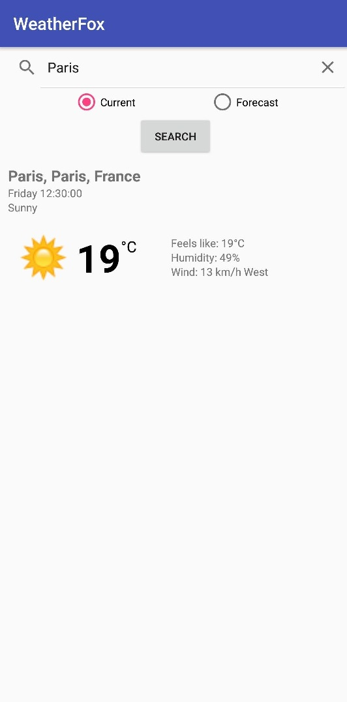
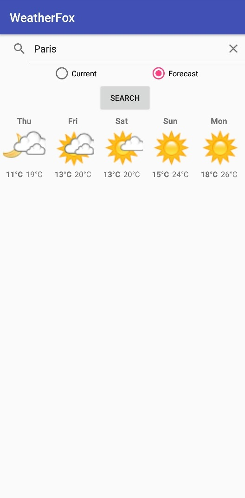

# WeatherFox

Application Android de Test Météo via l'API https://stdlib.com/@thisdavej/lib/weather/

Deux modes sont disponibles : 

- Current : Pour la météo du jour
- Forecast : Pour les prévisions des prochains jours

Internationalisation globale de l'application, internationalisation des réponses de l'API soon ...

## Librairies

- Retrofit 2 https://github.com/square/retrofit
- Picasso https://github.com/square/picasso
- Google Play Services Location

